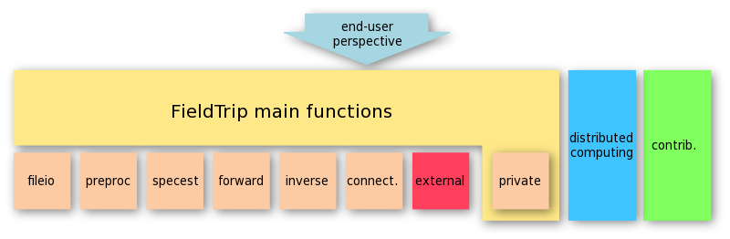

# Interoperability between Python, MATLAB, R, etc.

Sanne asked the question _"I often switch during my analysis between different programs, such as Python, MATLAB, Julia, and R. How can I automate this and make easier analysis scripts that are easier to develop, run and maintain?"_

# Outline

-   Simple: using wrappers and some glue code
    -   Quick and dirty: use the system() call
    -   Intermediate: using API bindings for another language
-   Sophisticated: use an external execution environment

# Using wrappers and some glue code

It is common for larger projects (or analysis pipelines) to have complex dependencies. A strategy to deal with them is to implement then in a modular fashion in which a distinction is made between high- and low-level code. See e.g. <http://www.fieldtriptoolbox.org/development/module/>.



The distinction is in reality more complex, since in general there are more layers. It is common that low-level code encapsulates even lower-level code (e.g. in private functions), but there can also be higher level code such as wrappers made by the researcher himself.

In general you can think of the code being organized in a [hierarchical structure with multiple layers](https://www.google.com/search?q=hierarchical+software+stack+organization&client=safari&rls=en&sxsrf=ALeKk024AsgZVGapGEvgsFjt0_uQ58yrgg:1590045625487&source=lnms&tbm=isch&sa=X&ved=2ahUKEwjD6LvFtcTpAhXPzqQKHWAhAdYQ_AUoAXoECA0QAw&biw=1566&bih=1012). The following example in FieldTrip for example applies to EEG forward model leadfield computations using the external OpenMEEG software that is implemented as a C/C++ command-line application:

1.  fieldtrip/ft_prepare_headmodel, which calls
2.  fieldtrip/forward/ft_headmodel_openmeeg, which calls
3.  fieldtrip/external/om_assemble, which calls
4.  om_assemble Linux command-line executables

or using the external SIMBIO software that uses mex files with a mix of C and Fortran:

1.  fieldtrip/ft_prepare_headmodel, which calls
2.  fieldtrip/forward/ft_headmodel_simbio, which calls
3.  fieldtrip/external/simbio mex-files

## Use the system() call

The simplest way to call external software when working in an interpreted enviroment is to use the `system()` call. This is available in Python as [os.system](https://docs.python.org/3/library/os.html#os.system), in MATLAB as the [system](https://nl.mathworks.com/help/matlab/ref/system.html) function, In Julia using [backticks and the run command](https://docs.julialang.org/en/v1/manual/running-external-programs/), and in R as [system](https://www.rdocumentation.org/packages/base/versions/3.6.2/topics/system).

In all cases the `system()` call executes another program as a command-line application, just like how it would be executed in the Linux or macOS terminal. So if you can write the piece of your analysis as a command-line application, you are good to go.

### Transforming your code in a command-line application

Using the [shebang](https://en.wikipedia.org/wiki/Shebang_(Unix)) syntax you can make scripts in any interpreted language executable. However, for some interpreters it is more common than for others.

### Making Python scripts executable

Your Python script `test1.py` would simply start with

```bash
#!/usr/bin/env python

import sys
import os
import argparse
from glob import glob


parser = argparse.ArgumentParser()
parser.add_argument("inputfile", nargs='+', help="input file file the computation")
parser.add_argument('--foo', nargs=1, help='foo help')
parser.add_argument('--bar', action="store_true", default=False, help='bar help')
args = parser.parse_args()

# show how the command line arguments work
print(args)

# here comes your Python code that deals with
# 1. the command-line options and the input files
# 2. performs the computations
# 3. writes the results to the STDOUT output or (better) to an output file
```

Furthermore, your Python script should be made executable using `chmod +x test1.py`.

### Making MATLAB scripts executable

Your MATLAB script `test2.m` cannot start with `#!/usr/bin/env matlab`, since the MATLAB interpreter does not take the name of the m-file directly as a command line argument. Rather, it requires commands to be passed in the `-r` option or in the `-batch` option. Furthermore, MATLAB does not understand the first line starting with `#` as a commented-out line.

To execute a piece of MATLAB code, you have to wrap it in a bit of BASH code like this

```bash
#!/usr/bin/env -S {1} ${2} bash

MATLAB=/Applications/MATLAB_R2020a.app/bin/matlab

TEMPSCRIPT=$(mktemp ${TMPDIR}matlabXXXXX).m
SCRIPTDIR=$(dirname ${TEMPSCRIPT})
SCRIPTNAME=$(basename ${TEMPSCRIPT} .m)

echo MATLAB=$MATLAB

echo TEMPSCRIPT=$TEMPSCRIPT
echo SCRIPTDIR=$SCRIPTDIR
echo SCRIPTNAME=$SCRIPTNAME

if [ -n $1 ]; then
  echo arg1="$1"
end

if [ -n $2 ]; then
  echo arg2="$2" >> ${TEMPSCRIPT}
end

# pass the first 4 command line options as MATLAB string variables
if [ -n $1 ]; then echo arg1 = \'$1\'\; >> ${TEMPSCRIPT}; fi
if [ -n $2 ]; then echo arg2 = \'$2\'\; >> ${TEMPSCRIPT}; fi
if [ -n $3 ]; then echo arg3 = \'$3\'\; >> ${TEMPSCRIPT}; fi
if [ -n $4 ]; then echo arg4 = \'$4\'\; >> ${TEMPSCRIPT}; fi

cat << EOF >> ${TEMPSCRIPT}

%%%%%%%%%%%%%%%%%%%%%%%%%%%%%%%%%%%%%%%%%%%%%%%%%%%%%%%%%%%%%%%%%%%%%%%%%%%%%%%%%%%%
% MATLAB CODE BEGINS

% here comes your MATLAB code that deals with
% 1. the command-line options and the input files
% 2. performs the computations
% 3. writes the results to the STDOUT output or (better) to an output file

ver('matlab')
plot(randn(10))
pause(5)

% MATLAB CODE ENDS
%%%%%%%%%%%%%%%%%%%%%%%%%%%%%%%%%%%%%%%%%%%%%%%%%%%%%%%%%%%%%%%%%%%%%%%%%%%%%%%%%%%%

EOF

MATLABCMD=$(printf 'addpath(%s%s%s); %s' "'" "$SCRIPTDIR" "'"  "$SCRIPTNAME")

${MATLAB} -batch "${MATLABCMD}"
```

Try copying this in a file `test2.m`, make it executable with `chmod +x test2.m` and run it.

_Note that the strategy above is also more or less how the evaluation of `qsubcellfun` and `qsubfeval` works, see [here](http://www.fieldtriptoolbox.org/faq/how_to_get_started_with_distributed_computing_using_qsub/) for details._

### Making Julia scripts executable

This works similar to Python, using the shebang syntax. See also [this post](https://discourse.julialang.org/t/useful-julia-script-tips-workaround-shebang/15584) on passing options to Julia.   

### Making R scripts executable

This works similar to Python, using the shebang syntax. See for example [this post](http://www.cureffi.org/2014/01/15/running-r-batch-mode-linux/).

### Exchanging parameters and input/output data

Since you probably also have to deal with parameters, input files, and output files, it is recommended to make a native wrapper in environment "A" around the code you want to execute using environment  "B". The examples given above already include some code that explains how to parse the additional command-line arguments.

When calling Python from within MATLAB, you could write a MATLAB function `test1.m` that takes some input arguments, writes those to disk, and that executes the `test1.py` file (see above) using a `system()` call. From the MATLAB perspective, you are only dealing with the `test1.m` function that encapsulates all complexities.

When calling MATLAB from within Python, you would write a Python function `test2` either in a separate module that you import, or in your main Python script. It takes some input arguments, writes those to disk or passes them as arguments, and it executes the `test2.m` file (see above) using a `system()` call.

## Using API bindings for another language

In many programming (or data analysis) environments it is possible to execute code that is implemented in other programming languages.

-   Python has an [API](https://docs.python.org/3/c-api/index.html) that allows programmers to extend it with C/C++ code
-   In Python you can also execute [Julia](https://pyjulia.readthedocs.io/en/latest/) code
-   MATLAB has [MEX files](https://nl.mathworks.com/help/matlab/call-mex-file-functions.html?s_tid=CRUX_lftnav) for C/C++ and Fortran code
-   MATLAB can access and execute [Java classes](https://nl.mathworks.com/help/matlab/using-java-libraries-in-matlab.html?s_tid=CRUX_lftnav), which is also used in its own graphical user interface and desktop
-   MATLAB can execute functions and objects in [Python](https://nl.mathworks.com/help/matlab/call-python-libraries.html?s_tid=CRUX_lftnav)
-   Julia can call external [C and Fortran code](https://docs.julialang.org/en/v1/manual/calling-c-and-fortran-code/)
-   R can call external [C and Fortran code](https://cran.r-project.org/doc/manuals/R-exts.html#System-and-foreign-language-interfaces)

 The advantage of this tighter binding over using the `system()` call is that you can directly pass variables between the two; there is no need to transfer input and output data using temporary files.

# Using an execution environment

-   GNU Make and [Makefiles](https://en.wikipedia.org/wiki/Makefile)
-   nipype
-   psom
-   [LONI](http://pipeline.loni.usc.edu)
-   [Taverna](https://taverna.incubator.apache.org)
-   Galaxy
